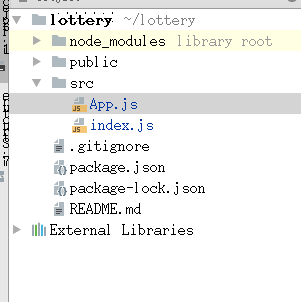
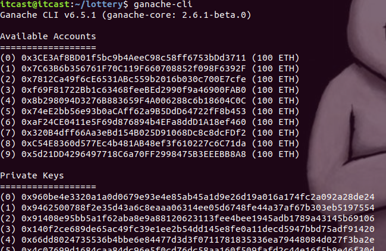

# 以太坊上的彩票开奖设计

## 前期准备

​	1.编写彩票合约，使用remix；

​	2.页面使用react脚手架；

​	3.使用nodejs+web3js与合约交互；

​	4.虚拟以太坊环境：巧克力

​		-图形化巧克力Ganache

​		-命令行版巧克力ganache-cli（比较稳定，常用）

## 业务需求

1.全民参与（任何地址都可以投注）

2.每个人每次只能投1个ether（相当于2元1注）

3.每个人可以买多注

4.设置一个管理员，负责：

- 定期开奖
- 临时退奖（防止有特殊情况）

## 合约设计

### **合约需要的状态变量**

​	   1.管理员：manager ，address类型

​	   2.记录所有的彩民的地址集合：players，address[]类型

​	   3.第几期：round  int

​	   4.上一期的中奖地址：winner，address

### **合约中的方法**

​	   1.参与投奖：play() payable（任何人都可以调用，调用时转入1ether到合约）

​	   2.管理员专用

​			-开奖：draw（）选择一个随机的地址，将合约的钱转入这个地址；

​			-退奖：undraw（）遍历所有的彩民，依次向彩民池中的地址转账，每人转账1ether。

**注意点：**

1. 退奖和开奖时需要花费的手续费是管理员地址账户中的钱；
2. 投奖时花费的手续费是用户账户中的钱；
3. 一句话：谁调用合约中的方法就花费谁的钱；
4. 对于用户来说，进出都是1eth永远不变；

### 合约代码

```js
pragma solidity ^0.4.25;

contract Lottery{
    //管理员地址
    address public manager;
    //所有彩民
    address[] public players;
    //彩票期数
    uint public round;
    //上一期中奖地址
    address public winner;
    //添加管理员地址
    constructor() public{
        manager=msg.sender;
    }

    //参与投奖
    function play() public payable{
        //要求调用时转入
        require(msg.value==1 * 10 ** 18);
        players.push(msg.sender);
    }
    //管理员开奖
    function draw() public onlyManager{
        //以太坊中没有提供随机数生成方法，可以随机生成一个哈希数，并将它对数组长度取余
        //取当前的难度值，时间戳和彩民人数作为随机数的种子
        bytes memory info = abi.encodePacked(block.difficulty,block.timestamp,players.length);
        bytes32 hash = keccak256(info);
        uint index = uint(hash)%players.length;
        winner = players[index];
        winner.transfer(address(this).balance);
        //彩民池清空同时期数加1
        delete players;
        round++;
    }
    
    //管理员退奖
    function undraw() public onlyManager{
        //遍历彩民数组，依次向彩民转账
        for(uint256 i=0;i<players.length;i++){
            players[i].transfer(1 ether);
        }
        delete players;
        round++;
    }
    /*******************辅助函数*************************/
    //获取奖金池额度
    function getBalance() public view returns(uint256){
        return address(this).balance;
    }
    //获取当前彩民
    function getPlayers() public view returns(address[]){
        return players;
    }
    //添加修饰器
    modifier onlyManager(){
        require(msg.sender==manager);
        _;
    }
}
```

## 前端部署（react）	

### 	**创建react空工程**

```sh
npm  i -g  create-react-app //安装react
create-react-app lottery	//创建项目文件夹
npm run start //运行react空工程
```

### 	 **清理react空工程**

​	

​	src文件夹下只保留App.js和index.js;

​	App.js以及Index.js文件夹下保留的内容：

```js
//App.js
import React from 'react';

function App() {
  return (
    <div className="App">
      hellowrold!
    </div>
  );
}
export default App;

//index.js
import React from 'react';
import ReactDOM from 'react-dom';

import App from './App';


ReactDOM.render(<App />, document.getElementById('root'));
```

​	浏览器中输入localhost:3000看到如下结果表示运行成功：	


## 合约交互

​	**安装solc编译器**

```sh
//执行该命令必须与package.json位于同一文件夹下
cd lottery
npm install solc@0.4.25 --save
```

​	**安装web3**

```sh
node install web3@1.2.1 --save
```

​	**启动命令行版本Ganache**

```sh
//如果没有命令行版本Ganache需要先进行安装
npm install ganache-cli -g
//启动巧克力
ganache-cli
```

​	启动之后如果出现如下情况表示Gananche安装成功：
